# NetSync workings
NetSync is a library that provides a way to synchronize data between different devices or systems. It is designed to be lightweight and easy to use, making it suitable for a wide range of applications.

The main focus of NetSync is providing a way to distribute data over a local network, rather than using a third-party system over the internet. E.g.:  Distributed Cache and Document Stores.

## Main components
- Discovery
  - Promotes the discovery of devices on the network using udp and tcp.
  - Uses a simple protocol to announce the presence of devices and to discover other devices on the network.
- IMessaging (Messaging)
  - Implements the messaging protocol for sending and receiving messages between devices.
- SyncData
  - Provides a way to synchronize data between devices.
  - Uses a simple protocol to send and receive data between devices.
- NetworkService
  - binds the Discovery to the IMessaging components for network communcation.

## Usage

Register the NetSync services in your application startup:

```csharp
// register NetSync services
services.AddNetSync();
```

Different options can be set:

### Manual mode
If you want to start the NetSync service manually, you can set the `ManualStart` option to `true`. This will prevent the service from starting automatically when the application starts. You will need to start the service manually by calling the `Start` method on the registered `NetSyncOptions`.
```csharp
services.AddNetSync(options =>
{
    options.ManualStart = true;
}
```

## Protocols to keep data in sync
- Introduction
  - The discovery module will announce the presence of a client on the network. The other clients will receive this announcement and add the client to their pool of clients.
  - Announcement -> Response -> New client asks random client to update.
- Update distribution
  - A client with an update will always send the updated data to all other clients in its pool.
- Gossip propagation
  - At random times, a client will check with a random connection in its pool to see if it has the latest data.
- Vector Clocks
  - Every client has a vector clock that is incremented when it receives data. Every time a client sends data, it includes its vector clock. The receiving client will update its vector clock to the maximum of the two clocks. The receiving client can determine if it is missing updates from certain other clients in the pool.
- Versioning (Timestamping)
  - Each data item has a version number. When a client receives data, it checks the version number. If the version number is higher than the current version number, the client updates its data. If the version number is lower, the client ignores the data.
- Keepalive
  - Each client sends a keep-alive message to all other clients in the pool at regular intervals. If a client does not receive a keep-alive message from another client within a certain time period, it assumes that the client is no longer available and removes it from the pool.
  - When a client reintroduces itself to the pool, an introduction handshake and vectorclock is exchanged.

### Sequene diagram

```mermaid
sequenceDiagram
    
    note left of A: Introduction/Discovery: One client
    rect rgb(25,55,25)
        participant A as Client A (new)
        Note over A: Discovery Announce (UDP), Alone on network, waits for announcements
        A-->A: Wait a second. No clients
    end

    note left of A: Introduction/Discovery: Two clients (A joins B)
    rect rgb(25,55,25)
        participant B as Client B (existing)
        Note over A: Discovery Announce (UDP)
        B->>A: Discovery Response (TCP)
        A-->A: Wait a second. One client
        A->>B: Ask for update
        B->>A: Update data and vector clock
    end

    note left of A: Introduction/Discovery: Three or more clients (A joins B and C)
    rect rgb(25,55,25)
        participant C as Client C (existing)
        Note over A: Discovery Announce (UDP)
        B->>A: Discovery Response (TCP)
        C->>A: Discovery Response (TCP)
        A-->A: Wait a second. Two clients, pick random (B)
        A->>B: Ask for update
        B->>A: Update data and vector clock
    end

    note left of A:  Update Distribution
    rect rgb(55,20,20)
        note over A: Client Update
        A->>B: Data Update
        A->>C: Data Update
    end

    note left of A:  Gossip Propagation
    rect rgb(55,55,20)
        note over A: Random interval
        A->>B: Vector Request (Random interval)
        B->>A: Vector Response
        note over A: Check difference
        opt
            A->>B: Data Update (if needed)
        end
    end

    note left of A:  Keepalive
    rect rgb(20,20,55)
        A->>B: Keepalive Ping (Interval)
        B->>A: Keepalive Pong
        Note over A: If no keepalive, client is removed from pool
    end

    note left of A:  Reintroduction One Client
    rect rgb(20,55,55)
        note over A: Discovery Announce (UDP)
        B->>A: Discovery Response (TCP)
        A-->A: Wait a second. One client
        A->>B: Vector request
        B->>A: Vector response
        note over A: Check difference
        opt
            A->>B: Ask for update
            B->>A: Data Update
        end
    end
```

